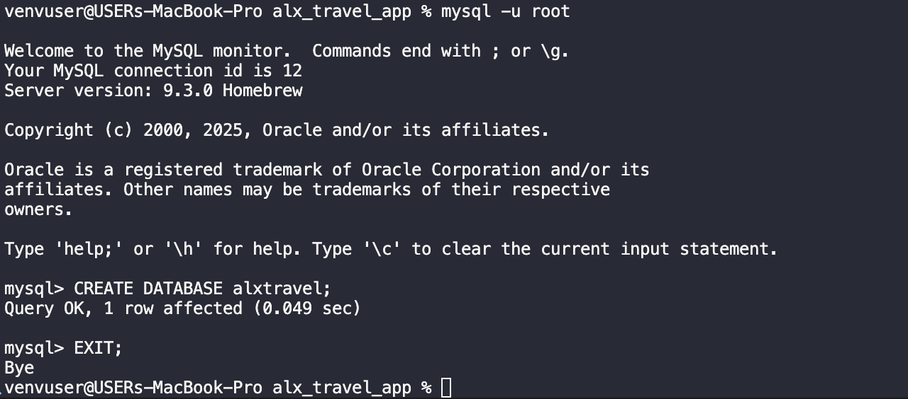

<<<<<<< HEAD

# alx_travel_app

A Django-based backend application developed as part of the ALX Software Engineering curriculum for the ProDev Backend Software Engineering Program. The project serves as the foundation for a travel listings platform with structured configurations, API documentation, and MySQL integration.

---

## Project Description

The `alx_travel_app` project is a scalable backend application built using Django and Django REST Framework. It focuses on setting up a maintainable structure, configuring a MySQL database connection using environment variables, and generating automated API documentation with Swagger.

---

## Features

- Modular Django project setup
- MySQL database integration
- RESTful API development using Django REST Framework
- Environment-based configuration management using `django-environ`
- Swagger UI for interactive API documentation (`drf-yasg`)
- CORS support for API access from external clients
- Project structure suitable for team collaboration and production readiness

---

## Technologies Used

- Python 3.13
- Django 5.2.4
- MySQL
- Django REST Framework
- django-environ
- django-cors-headers
- drf-yasg
- Celery & RabbitMQ (for background task support)

---

## Directory Structure

```
alx_travel_app/
├── alx_travel_app/
│   ├── settings.py
│   ├── urls.py
│   └── ...
├── listings/
│   ├── models.py
│   ├── views.py
│   └── ...
├── manage.py
├── requirements.txt
└── .env
```

---

## Installation & Setup

1. **Clone the Repository**

```bash
git clone https://github.com/Stormz99/alx_travel_app.git
cd alx_travel_app
```

2. **Create Virtual Environment & Install Dependencies**

```bash
python3 -m venv venv
source venv/bin/activate
pip install -r requirements.txt
```


3. **Configure Environment Variables**

Create a `.env` file in the root directory and include:

```env
DB_NAME=alxtravel
DB_USER=yourusername
DB_PASSWORD=yourpassword
DB_HOST=yourhostname
DB_PORT=yourportnumber
```



> Ensure the database `alxtravel` exists in MySQL.

4. **Run Migrations**

```bash
python manage.py migrate
```


5. **Start the Development Server**

```bash
python manage.py runserver
```
[runserver](./images/running_the_server.png)

Visit: `http://127.0.0.1:8000/swagger/` to view the API documentation.

---


## Swagger Documentation

- Swagger is available at: `http://127.0.0.1:8000/swagger/`
- Automatically documents all available API endpoints


]

---

## Requirements

All dependencies are listed in the `requirements.txt` file. Notable packages include:

- `Django`
- `djangorestframework`
- `django-cors-headers`
- `django-environ`
- `drf-yasg`
- `mysqlclient`
- `celery`, `kombu`, `amqp`

---

## License

This project is maintained as part of the ALX Software Engineering curriculum. All rights reserved © 2025 ALX.
=======
# alx_travel_app
>>>>>>> 80d132a268893e733e61c53c65b2b8593645a818
